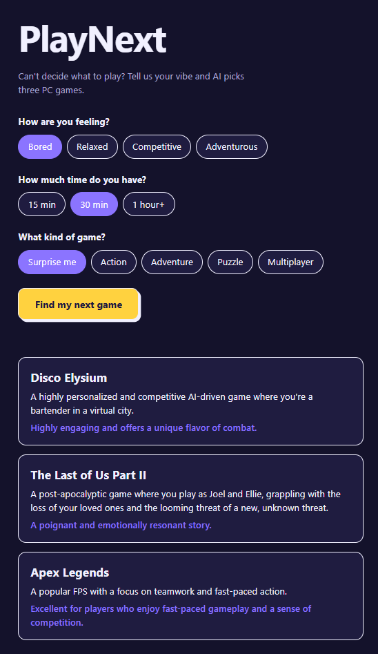

# PlayNext 🎮

**Stop scrolling. Start playing.**

PlayNext is a small website that helps gamers decide what to play next. You pick your mood, how much time you have and the kind of game you want, and a local open-weight AI model (Gemma, running through Ollama) suggests three PC games.




## The Problem

My friends and I often spend more time deciding what to play than actually playing. PlayNext was built for a friend who loves PC gaming but can't pick a game when they sit down to play.

## The Solution

1. Choose how you're feeling: Bored, Relaxed, Competitive or Adventurous.
2. Choose your time: 15 minutes, 30 minutes or 1 hour+.
3. Choose a genre: Surprise me, Action, Adventure, Puzzle or Multiplayer.
4. Get three PC game recommendations, each with a short description and a reason it fits.

The recommendations are generated by the AI model (gemma) each time. They are not hardcoded.

## Tech Stack

- HTML, CSS and vanilla JavaScript 
- [Gemma](https://ai.google.dev/gemma) (`gemma3:270m`), an open-weight model
- [Ollama](https://ollama.com) to run the model locally

## How It Works

1. `script.js` reads your three choices and builds a prompt.
2. It sends the prompt to Ollama's local API (`http://localhost:11434/api/generate`) and asks for JSON output.
3. The page parses the JSON and shows three game cards.
4. If the model returns bad JSON, the page retries up to 3 times.

## Run It Locally

You need [Ollama](https://ollama.com/download) and any  local web server.

```bash
# 1. Download the model
ollama pull gemma3:270m

# 2. Clone this repo
git clone https://github.com/YOUR-USERNAME/playnext.git
cd playnext

# 3. Serve the page for Example 
python -m http.server 8000
```

Then open <http://localhost:8000> and click **Find my next game**.

### Using a different model

Open `script.js` and change the `MODEL` line. Larger models such as `gemma3:1b` or `gemma3:4b` give better recommendations. Run `ollama list` to see the exact names of the models you have installed.

### Troubleshooting

- **"Can't reach Ollama":** Make sure Ollama is running, and open the page through `http://localhost:8000`, not by double-clicking `index.html`. If your browser still blocks the request, allow the page's origin and restart Ollama, for example `OLLAMA_ORIGINS="http://localhost:8000" ollama serve` on Mac/Linux.
- **"Model not found":** Run `ollama pull gemma3:270m`.
- **Error after a few tries:** The model sometimes fails to produce valid JSON. Click the button again.

## Limitations

- `gemma3:270m` is very small. It is fast and runs on almost any computer, but it can invent games, repeat the example games from the prompt, or give generic reasons. Double-check any title you don't recognize.
- The app needs Ollama running on your own computer, so it can't be hosted publicly on a site like GitHub Pages and used by other visitors without extra setup.

## Open Innovation

PlayNext uses an open-weight model that runs entirely on the user's own machine. There are no API keys, no usage fees and no data sent to a third-party service. Anyone can swap in a different model, change the prompt or adapt the project for their own friends.

## Project Structure

```
playnext/
├── index.html   # page structure and form
├── style.css    # styling
├── script.js    # prompt building, Ollama call, results display
└── README.md
```

## Built For

A friend who loves PC gaming but can never decide what to play next.

## Project Status

Built for the  Hacktoberfest launch Weekend Challenge 2026.

## License
 MIT License
